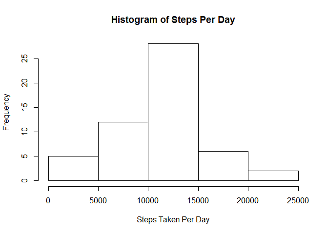
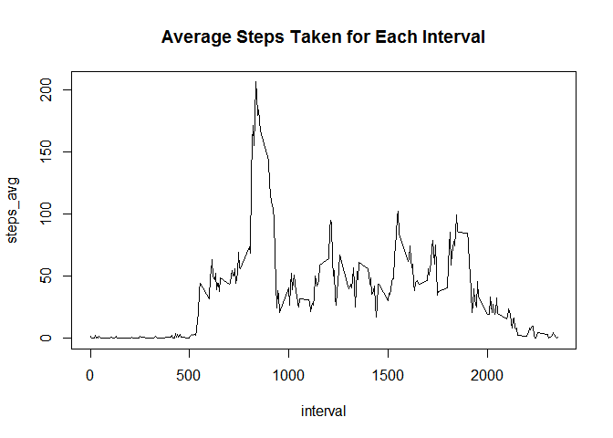
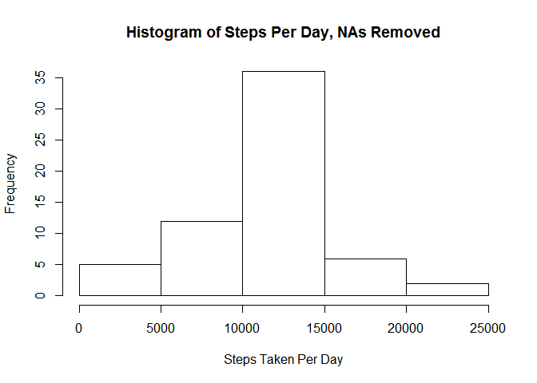

# Reproducible Research: Peer Assessment 1


## Loading and preprocessing the data
<br>


```r
setwd("C:/Users/Cubbi_000/Desktop/Coursera/reproducible_research/project1/RepData_PeerAssessment1")
unzip('activity.zip')
activity <- read.csv('activity.csv')
```
  
<br>
These are the summary statistics of our resulting activity dataframe  
<br>
  

```r
summary(activity)
```

```
##      steps                date          interval     
##  Min.   :  0.00   2012-10-01:  288   Min.   :   0.0  
##  1st Qu.:  0.00   2012-10-02:  288   1st Qu.: 588.8  
##  Median :  0.00   2012-10-03:  288   Median :1177.5  
##  Mean   : 37.38   2012-10-04:  288   Mean   :1177.5  
##  3rd Qu.: 12.00   2012-10-05:  288   3rd Qu.:1766.2  
##  Max.   :806.00   2012-10-06:  288   Max.   :2355.0  
##  NA's   :2304     (Other)   :15840
```


## What is mean total number of steps taken per day?

<br>
We're going to use the dplyr package to group the results by each day. 
<br>


```r
library(dplyr)
```

```
## 
## Attaching package: 'dplyr'
## 
## The following object is masked from 'package:stats':
## 
##     filter
## 
## The following objects are masked from 'package:base':
## 
##     intersect, setdiff, setequal, union
```

<br>
The table total_steps will have each day and the total number of steps taken during the course of that day
<br>


```r
by_day <- group_by(activity, date)
total_steps <- summarize(by_day, steps = sum(steps))
hist(total_steps$steps, xlab = 'Steps Taken Per Day', main = 'Histogram of Steps Per Day')
```

 

<br>
The summary will tell us the mean and median of steps per day.
<br>


```r
summary(total_steps)
```

```
##          date        steps      
##  2012-10-01: 1   Min.   :   41  
##  2012-10-02: 1   1st Qu.: 8841  
##  2012-10-03: 1   Median :10765  
##  2012-10-04: 1   Mean   :10766  
##  2012-10-05: 1   3rd Qu.:13294  
##  2012-10-06: 1   Max.   :21194  
##  (Other)   :55   NA's   :8
```

<br>
On average, this person took 10,766 steps per day for each day that was recorded.   
The median is very similar, at 10,765 steps per day.
<br>

## What is the average daily activity pattern?


```r
by_time <- group_by(activity, interval)
steps_time <- summarize(by_time, steps_avg = mean(steps, na.rm = TRUE))
with(steps_time, plot(interval, steps_avg, type = 'l', main = 'Average Steps Taken for Each Interval'))
```

 


```r
steps_time[steps_time$steps_avg == max(steps_time$steps_avg),]
```

```
## Source: local data frame [1 x 2]
## 
##   interval steps_avg
## 1      835  206.1698
```

## Imputing missing values


```r
summary(activity[apply(is.na(activity), 1, any), ])
```

```
##      steps              date        interval     
##  Min.   : NA    2012-10-01:288   Min.   :   0.0  
##  1st Qu.: NA    2012-10-08:288   1st Qu.: 588.8  
##  Median : NA    2012-11-01:288   Median :1177.5  
##  Mean   :NaN    2012-11-04:288   Mean   :1177.5  
##  3rd Qu.: NA    2012-11-09:288   3rd Qu.:1766.2  
##  Max.   : NA    2012-11-10:288   Max.   :2355.0  
##  NA's   :2304   (Other)   :576
```


```r
activity2 <- left_join(activity, steps_time)
```

```
## Joining by: "interval"
```

```r
activity2[is.na(activity2$steps),1] <- activity2[is.na(activity2$steps),4]
act.no.na <- activity2[,1:3]
```


```r
by_day2 <- group_by(act.no.na, date)
total_steps2 <- summarize(by_day2, steps = sum(steps))
hist(total_steps2$steps, xlab = 'Steps Taken Per Day', main = 'Histogram of Steps Per Day, NAs Removed')
```

 


```r
summary(total_steps2)
```

```
##          date        steps      
##  2012-10-01: 1   Min.   :   41  
##  2012-10-02: 1   1st Qu.: 9819  
##  2012-10-03: 1   Median :10766  
##  2012-10-04: 1   Mean   :10766  
##  2012-10-05: 1   3rd Qu.:12811  
##  2012-10-06: 1   Max.   :21194  
##  (Other)   :55
```

## Are there differences in activity patterns between weekdays and weekends?


```r
activity$date <- as.Date(activity$date)
activity$day <- weekdays(activity$date)
activity$weekday <- activity$day %in% c('Saturday', 'Sunday')
```


