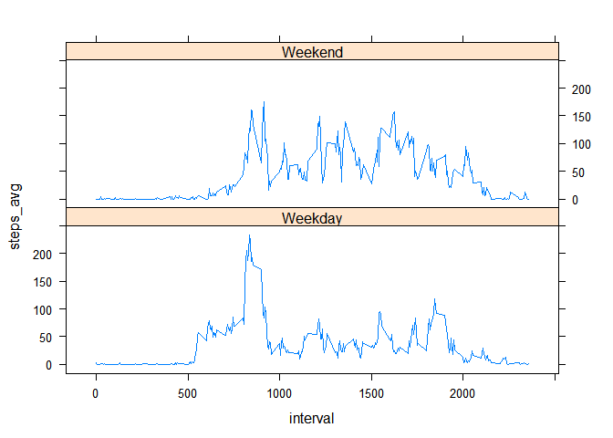

# Reproducible Research: Peer Assessment 1


## Loading and preprocessing the data

Here we set our working directory, unzip the zip file, and use the read.csv function to put the csv into a dataframe


```r
setwd("C:/Users/Cubbi_000/Desktop/Coursera/reproducible_research/project1/RepData_PeerAssessment1")
unzip('activity.zip')
activity <- read.csv('activity.csv')
```
  

These are the summary statistics of our resulting activity dataframe  

  

```r
summary(activity)
```

```
##      steps                date          interval     
##  Min.   :  0.00   2012-10-01:  288   Min.   :   0.0  
##  1st Qu.:  0.00   2012-10-02:  288   1st Qu.: 588.8  
##  Median :  0.00   2012-10-03:  288   Median :1177.5  
##  Mean   : 37.38   2012-10-04:  288   Mean   :1177.5  
##  3rd Qu.: 12.00   2012-10-05:  288   3rd Qu.:1766.2  
##  Max.   :806.00   2012-10-06:  288   Max.   :2355.0  
##  NA's   :2304     (Other)   :15840
```


## What is mean total number of steps taken per day?


We're going to use the dplyr package to group the results by each day.


```r
library(dplyr)
```

```
## 
## Attaching package: 'dplyr'
## 
## The following object is masked from 'package:stats':
## 
##     filter
## 
## The following objects are masked from 'package:base':
## 
##     intersect, setdiff, setequal, union
```


The dataframe total_steps will have each day and the total number of steps taken during the course of that day. 
This is done through the group_by function that is found in the dplyr package.


```r
by_day <- group_by(activity, date)
total_steps <- summarize(by_day, steps = sum(steps))
hist(total_steps$steps, xlab = 'Steps Taken Per Day', main = 'Histogram of Steps Per Day')
```

 


The summary will tell us the mean and median of steps per day.


```r
summary(total_steps)
```

```
##          date        steps      
##  2012-10-01: 1   Min.   :   41  
##  2012-10-02: 1   1st Qu.: 8841  
##  2012-10-03: 1   Median :10765  
##  2012-10-04: 1   Mean   :10766  
##  2012-10-05: 1   3rd Qu.:13294  
##  2012-10-06: 1   Max.   :21194  
##  (Other)   :55   NA's   :8
```


On average, this person took 10,766 steps per day for each day that was recorded.   
The median is very similar, at 10,765 steps per day.


## What is the average daily activity pattern?

Instead of grouping by the day, instead this time we're going to group by the time interval, 
because we want to see what parts of the day most of the steps are taken in.
From there, we'll plot a the average number of steps per interval to see when most of the activity occurs.


```r
by_time <- group_by(activity, interval)
steps_time <- summarize(by_time, steps_avg = mean(steps, na.rm = TRUE))
with(steps_time, plot(interval, steps_avg, type = 'l', main = 'Average Steps Taken for Each Interval'))
```

 

We can see most of the activity occurs in the morning.
We can find the max interval by subsetting the row equal to the max.


```r
steps_time[steps_time$steps_avg == max(steps_time$steps_avg),]
```

```
## Source: local data frame [1 x 2]
## 
##   interval steps_avg
## 1      835  206.1698
```

Interval 835 has the highest activity, probably walking to work or school.

## Imputing missing values

There are a significant amount of NAs in the steps column as we can see from this summary function.


```r
summary(activity[apply(is.na(activity), 1, any), ])
```

```
##      steps              date        interval     
##  Min.   : NA    2012-10-01:288   Min.   :   0.0  
##  1st Qu.: NA    2012-10-08:288   1st Qu.: 588.8  
##  Median : NA    2012-11-01:288   Median :1177.5  
##  Mean   :NaN    2012-11-04:288   Mean   :1177.5  
##  3rd Qu.: NA    2012-11-09:288   3rd Qu.:1766.2  
##  Max.   : NA    2012-11-10:288   Max.   :2355.0  
##  NA's   :2304   (Other)   :576
```

First we're going to left join to the steps_time table, which has our average number of steps for each interval.
From there we can impute those NAs with the average number of steps for that interval.
Finally, create another dataframe that drops the steps average per interval to avoid confusion.


```r
activity2 <- left_join(activity, steps_time)
```

```
## Joining by: "interval"
```

```r
activity2[is.na(activity2$steps),1] <- activity2[is.na(activity2$steps),4]
act.no.na <- activity2[,1:3]
```

We can make a histogram of the new amount of steps per day. 
It looks pretty similar to the histogram without the imputed values


```r
by_day2 <- group_by(act.no.na, date)
total_steps2 <- summarize(by_day2, steps = sum(steps))
hist(total_steps2$steps, xlab = 'Steps Taken Per Day', main = 'Histogram of Steps Per Day, NAs Removed')
```

 


```r
summary(total_steps2)
```

```
##          date        steps      
##  2012-10-01: 1   Min.   :   41  
##  2012-10-02: 1   1st Qu.: 9819  
##  2012-10-03: 1   Median :10766  
##  2012-10-04: 1   Mean   :10766  
##  2012-10-05: 1   3rd Qu.:12811  
##  2012-10-06: 1   Max.   :21194  
##  (Other)   :55
```

The median is now exactly equal to the mean. The mean has stayed the same.
Imputing NA values with the interval's average makes very little difference.

## Are there differences in activity patterns between weekdays and weekends?

For this final question we're going to use the lattice package to make a graph comparing weekdays and weekends


```r
library(lattice)
```

First, we can take each date and determine what day of the week it is with the weekdays function.
Then, those can be classified into weekends or weekdays.

We can then make a line graph for the two types of days to see if there's a difference between weekdays and weekends.


```r
activity$date <- as.Date(activity$date)
activity$day <- weekdays(activity$date)
activity$weekday <- as.factor(ifelse(activity$day %in% c('Saturday','Sunday'), 'Weekend', 'Weekday'))

by_time2 <- group_by(activity, interval, weekday)
steps_time2 <- summarize(by_time2, steps_avg = mean(steps, na.rm = TRUE))

with(steps_time2, xyplot(steps_avg ~ interval | weekday, layout = c(1,2), type = 'l'))
```

 


Conclusion: The distribution of steps is much more even during the weekends than during the weekdays.
This makes more sense, as the person might have an office job or be in class, which causes less walking during the middle of the day.


